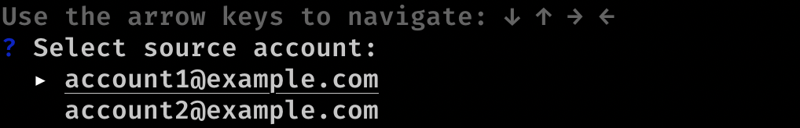

# cf-transfer



## Installation

 - binary can be downloaded from the GitHub [releases page](https://github.com/korchasa/cf-transfer/releases).
 - `cf-transfer` can be installed via go toolkit using `go get github.com/korchasa/cf-transfer && go install github.com/korchasa/cf-transfer
`
 - docker image can be downloaded using `docker pull ghcr.io/korchasa/cf-transfer:latest`.

## Usage 

```bash
export CLOUDFLARE_EMAIL=<API Email address associated with your account>
export CLOUDFLARE_KEY=<API Key generated on the 'My Profile' page>
cf-transfer
```


